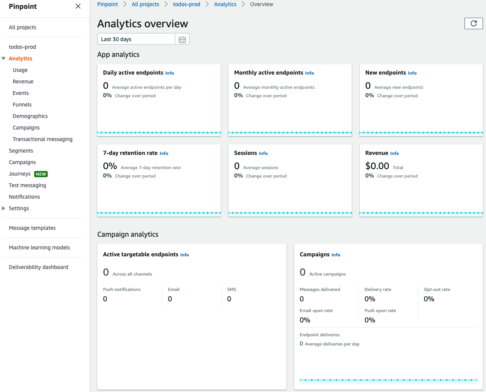
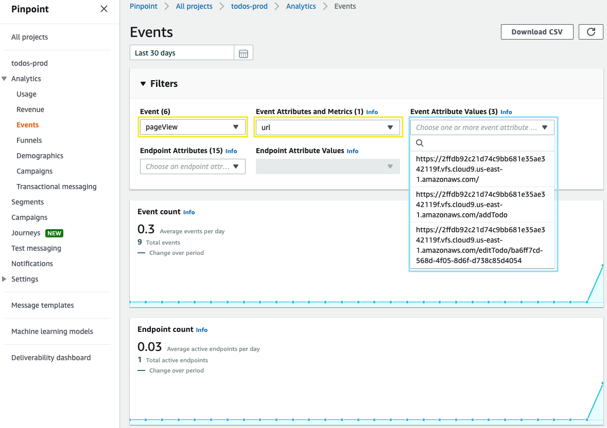

# Adding Analytics

Now that we have authenticated users, let’s add analytics that enables you to collect data for your app.

## 1. Adding Amplify analytics

1.1\. Using the Amplify CLI add analytics to the application and use the following values.

``` bash
amplify add analytics
```

? Provide your pinpoint resource name: **todos**

Adding analytics would add the Auth category to the project if not already added.

? Apps need authorization to send analytics events. Do you want to allow guests and unauthenticated users to send analytics events? (we recommend you allow this when getting started) **Yes**


1.2\. Push to create these changes in the cloud.

``` bash
amplify push
```

? Are you sure you want to continue? **Yes**

⠏ Updating resources in the cloud. This may take a few minutes...

1.3\. After resources are created you will receive the URL for Amazon Pinpoint console to track your app events.




**Congratulations! You’ve just created the Amazon Pinpoint application to collect data analytics.**

## 2. Configure React application with analytics

2.1\. Update the contents of **src/index.js** with the following.

``` javascript hl_lines="6 14 15 16 17 18 19 20 21 22 23 24 25 26 27 28 29 30 31"
import React from 'react';
import ReactDOM from 'react-dom';
import './index.css';
import App from './App';
import * as serviceWorker from './serviceWorker';
import Analytics from '@aws-amplify/analytics';

ReactDOM.render(<App />, document.getElementById('root'));

// If you want your app to work offline and load faster, you can change
// unregister() to register() below. Note this comes with some pitfalls.
// Learn more about service workers: https://bit.ly/CRA-PWA
serviceWorker.unregister();
Analytics.autoTrack('session', {
    enable: true,
    attributes: {
        attr: 'attr'
    },
});

Analytics.autoTrack('pageView', {
    // REQUIRED, turn on/off the auto tracking
    enable: true,
    eventName: 'pageView',
    // OPTIONAL, by default is 'multiPageApp'
    // you need to change it to 'SPA' if your app is a single-page app like React
    type: 'SPA',
    getUrl: () => {
        return window.location.origin + window.location.pathname;
    }
});
```

2.2\. Update the contents of **src/components/itemTodo.js** with the following.

``` javascript hl_lines="20 21 22 55 60 75 79 80 81 82 83 84 85 86 87 88 89 "
import React, { useState } from "react";
import { makeStyles } from "@material-ui/core/styles";
import {
  IconButton,
  Grid,
  Avatar,
  Card,
  Typography,
  CardActions,
  Divider
} from "@material-ui/core";
import TimeAgo from "react-timeago";
import clsx from "clsx";
import VolumeUpIcon from "@material-ui/icons/VolumeUp";
import TranslateIcon from "@material-ui/icons/Translate";
import EditIcon from "@material-ui/icons/Edit";
import DeleteIcon from "@material-ui/icons/Delete";
import { useHistory } from "react-router-dom";

import Analytics from '@aws-amplify/analytics';
import awsconfig from '../aws-exports';
Analytics.configure(awsconfig);

const useStyles = makeStyles(theme => ({
  itemTodo: {
    padding: 15,
    marginTop: theme.spacing(1)
  },
  button: {
    marginTop: theme.spacing(1)
  },
  listen: {
    marginLeft: 5
  },
  translate: {
    marginTop: 15
  },
  expand: {
    marginLeft: "auto"
  },
  expandOpen: {
    transform: "rotate(180deg)"
  }
}));

function ItemTodo(props) {
  console.log(props);
  const classes = useStyles();
  const [showTranslate, setShowTranslate] = useState(false);
  const [translatedText, setTranlatedText] = useState("");
  let history = useHistory();

  const handleClickListenOriginal = event => {
    console.log("Listen Original");
    sendSpeechAnalytics("English");
  };

  const handleClickListenTranslate = event => {
    console.log("Listen Translate");
    sendSpeechAnalytics("Spanish");
  };

  const handleClickEdit = event => {
    console.log("Edit todo");
    history.push("/editTodo/" + props.item.id);
  };

  const handleClickTranslate = event => {
    if (showTranslate) {
      setShowTranslate(false);
      setTranlatedText("");
    } else {
      setShowTranslate(true);
      setTranlatedText("Ejemplo de texto.");
      sendTranslateAnalytics();
    }
  };
  
  const sendTranslateAnalytics = async () => {
    Analytics.record({ name: 'translate' }).then( (evt) => {
            console.log("Event Submitted" + JSON.stringify(evt));
        });
  };
  
  const sendSpeechAnalytics = async (value) => {
    Analytics.record({ name: 'speech', attributes: { lang: value } }).then( (evt) => {
            console.log("Event Submitted" + JSON.stringify(evt));
        });
  };

  return (
    <Card className={classes.itemTodo}>
      <Grid container wrap="nowrap" spacing={2}>
        <Grid item>
          <Avatar>W</Avatar>
        </Grid>
        <Grid item xs zeroMinWidth>
          <Typography variant="h6" gutterBottom>
            {props.item.description}
            <IconButton
              id="listenOriginal"
              className={classes.listen}
              aria-label="Listen"
              size="small"
              onClick={handleClickListenOriginal}
            >
              <VolumeUpIcon />
            </IconButton>
          </Typography>
          <div style={showTranslate ? {} : { display: "none" }}>
            <Divider />
            <Typography variant="h6" gutterBottom className={classes.translate}>
              {translatedText}
              <IconButton
                id="listenTranslate"
                className={classes.listen}
                aria-label="Listen"
                size="small"
                onClick={handleClickListenTranslate}
              >
                <VolumeUpIcon />
              </IconButton>
            </Typography>
          </div>
          <CardActions disableSpacing>
            <TimeAgo date={props.item.dateAt} className={classes.dateAt} />
            <IconButton
              className={clsx(classes.expand)}
              aria-label="Delete"
              onClick={() => props.onDelete(props.item)}
            >
              <DeleteIcon />
            </IconButton>
            <IconButton aria-label="Edit" onClick={handleClickEdit}>
              <EditIcon />
            </IconButton>
            <IconButton aria-label="Translate" onClick={handleClickTranslate}>
              <TranslateIcon />
            </IconButton>
          </CardActions>
        </Grid>
      </Grid>
    </Card>
  );
}

export default ItemTodo;
```
2.3\. Update the contents of **src/App.js** with the following.

``` javascript hl_lines="1 11 23 24 25 26 31 32 33 34 35 36 37 38 39 40 41 42 43 44 45 46 47 48 49 50"
import React, { useEffect } from "react";
import { makeStyles } from "@material-ui/core/styles";
import CssBaseline from "@material-ui/core/CssBaseline";
import Container from "@material-ui/core/Container";
import IndexTodos from "./components/indexTodos.js";
import AddTodo from "./components/addTodo.js";
import EditTodo from "./components/editTodo.js";
import Paper from "@material-ui/core/Paper";
import { BrowserRouter as Router, Switch, Route } from "react-router-dom";

import Analytics from '@aws-amplify/analytics';
import { Auth } from 'aws-amplify'
import awsconfig from './aws-exports';
import { withAuthenticator } from 'aws-amplify-react';
Auth.configure(awsconfig);

const useStyles = makeStyles(theme => ({
  root: {
    padding: theme.spacing(5, 2)
  }
}));

const mapObj = f => obj =>
  Object.keys(obj).reduce((acc, key) => ({ ...acc, [key]: f(obj[key]) }), {});
const toArrayOfStrings = value => [`${value}`];
const mapToArrayOfStrings = mapObj(toArrayOfStrings);

function App() {
  const classes = useStyles();
  
  useEffect(() => {
    trackUserId();
  }, []);
  
  async function trackUserId() {
    try {
      const { attributes } = await Auth.currentAuthenticatedUser();
      const userAttributes = mapToArrayOfStrings(attributes);
      console.log("-----> " + JSON.stringify(userAttributes));
      Analytics.updateEndpoint({
        address: userAttributes.email[0],
        channelType: 'EMAIL',
        optOut: 'NONE',
        userId: userAttributes.sub[0],
        userAttributes,
      });
    } catch (error) {
      console.log(error);
    }
  }

  return (
    <div className="App">
      <Router>
        <React.Fragment>
          <CssBaseline />
          <Container
            fixed
            maxWidth="sm"
            style={{ height: "100vh", paddingTop: 20 }}
          >
            <Paper className={classes.root}>
              <Switch>
                <Route path="/" exact component={IndexTodos} />
                <Route path="/addTodo" component={AddTodo} />
                <Route path="/editTodo/:idTodo" component={EditTodo} />
              </Switch>
            </Paper>
          </Container>
        </React.Fragment>
      </Router>
    </div>
  );
}

export default withAuthenticator(App, {includeGreetings: true});
```

2.4\. Go back to your application running and navigate between pages.

2.5\. To see the results visit the Amazon Pinpoint console https://console.aws.amazon.com/pinpoint/.

