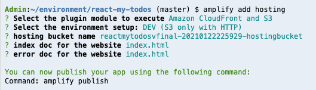

# Adding Hosting

The AWS Amplify CLI makes it easy to deploy our app to an Amazon S3 bucket and CloudFront.

## 1. Adding hosting, build and publish our application

1.1\. Using the Amplify CLI add hosting for the application and use the following values.

``` bash
amplify add hosting
```
? Select the plugin module to execute: Amazon CloudFront and S3 

? Select the environment setup: **DEV (S3 only with HTTP)**

? hosting bucket name **react-my-todos-20190709233955-hostingbucket** (Use default name)

? index doc for the website **index.html**

? error doc for the website **index.html**



1.2\. Publish your React application.

``` bash
amplify publish
```

? Are you sure you want to continue? **Yes**

1.3\. After your app is published, use the endpoint resulted to get into your application.


!!! done
    **Congratulations!!!** Now you have a modern application deployed using AWS Amplify.