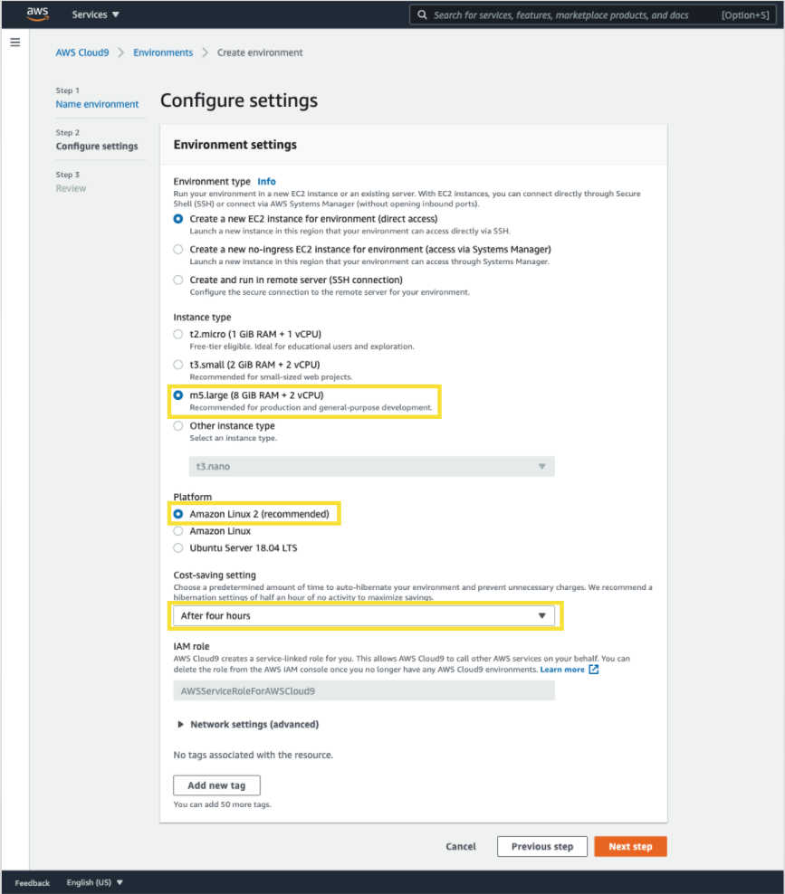
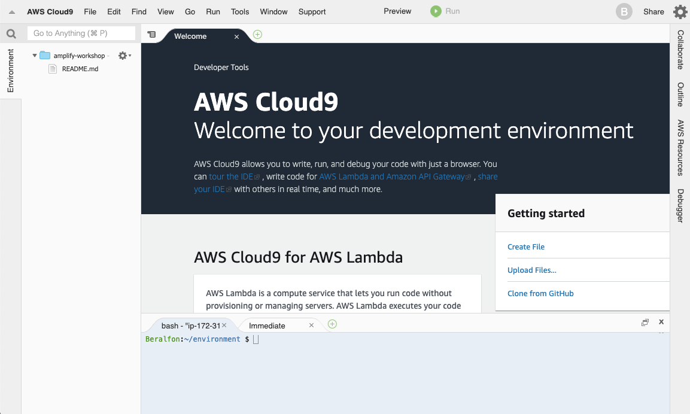
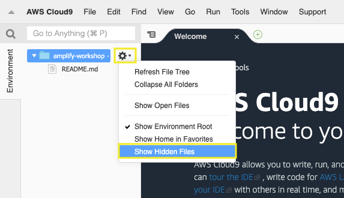
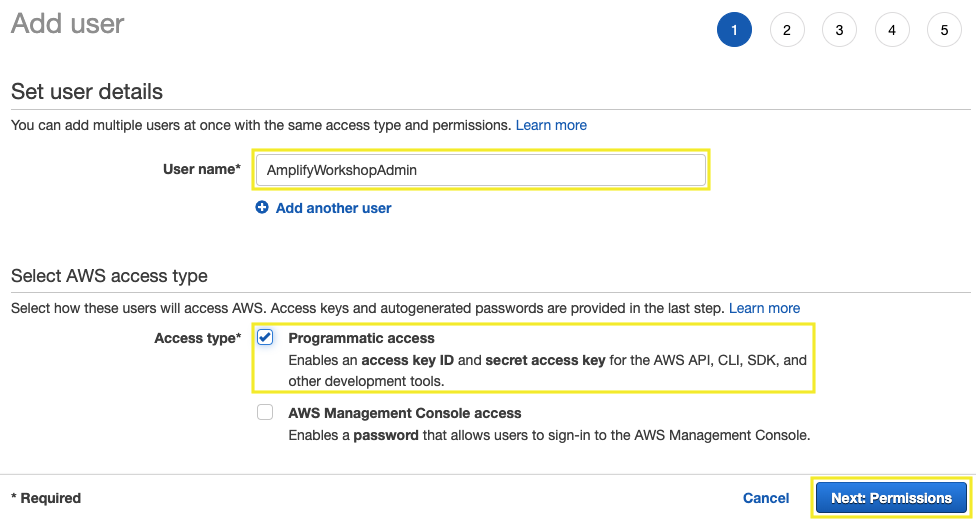
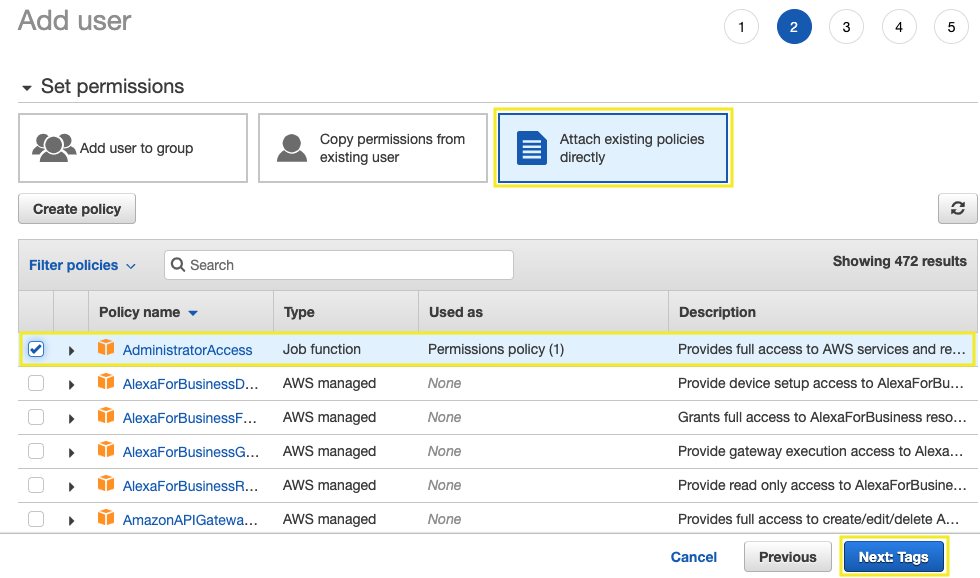
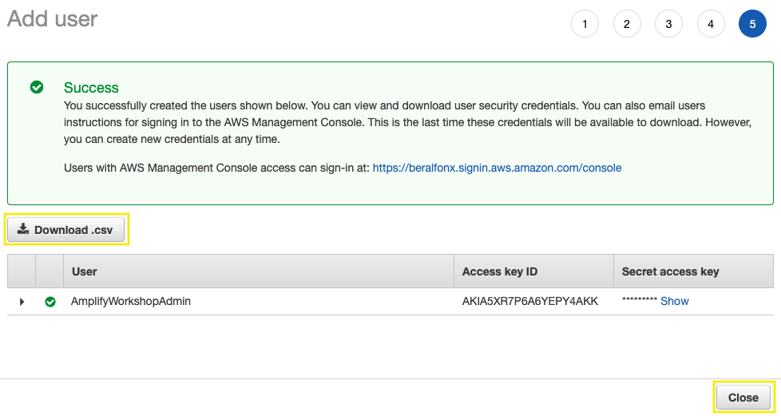
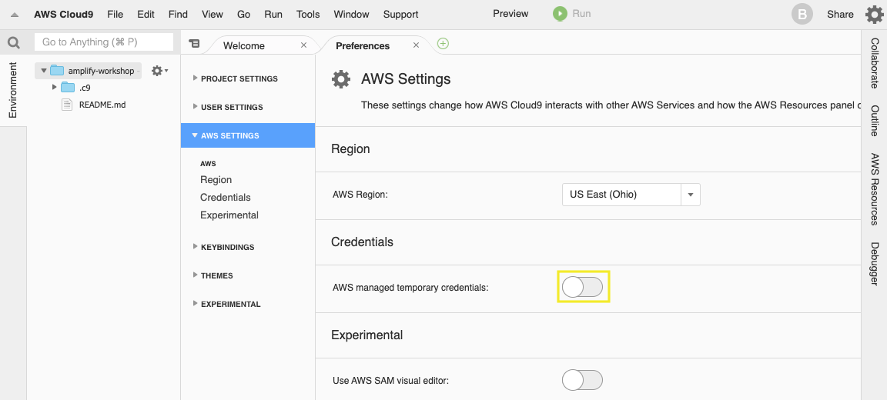
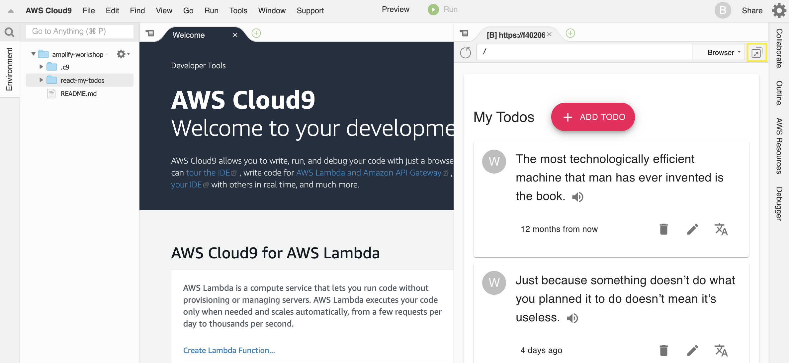
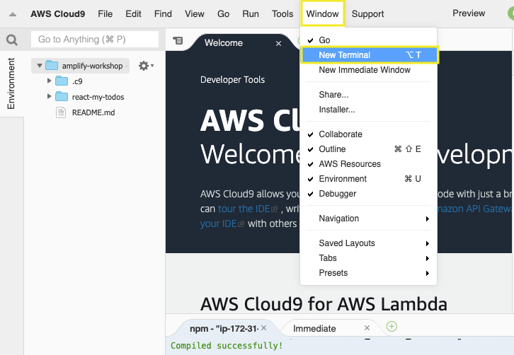

# Preparing your development environment

## 1. Create a Cloud9 instance for development

1.1\. Open the AWS Cloud9 console at https://console.aws.amazon.com/cloud9/.

1.2\. Click on **Create environment**.


1.3\. For the **Name** type `amplify-workshop`, and choose **Next step**.


1.4\. For the **Configure settings** section, select the instance type **m5.large**, Platform **Amazon Linux 2 (recommended)**, Cost-saving setting **After four hours** and choose **Next step**.



1.5\. For the **Review** section click on **Create environment**.

1.6\. Wait a few seconds until your development environment is ready, you will see the following screen.



1.7\. For this lab is required to see hidden files, click on preference icon and click on **Show Hidden Files**.



## 2. Create an IAM user with administrator privileges

2.1\. Open the IAM console at https://console.aws.amazon.com/iam/.

2.2\. Choose **Users**, then **Add user**.

2.3\. Type a name for your user `AmplifyWorkshopAdmin`, choose **Programmatic access** and click **Next: Permissions**.



2.4\. Click **Attach permissions policies** and select **Administrator Access**, choose **Next: Tags**.



2.5\. For **Add tags (optional)** section choose **Next: Review**.

2.6\. Click on **Create user**.

2.7\. To save the credentials, choose **Download .csv** and then save the file to a safe location, and **Close**.



## 3. Configure your AWS CLI with your IAM credentials

3.1\. Inside the Cloud9 environment, click on **AWS Cloud9** and **Preferences**.


3.2\. Select **AWS SETTINGS** and turn off **AWS managed temporary credentials**.



3.3\. In the **bash** terminal we are going to configure the AWS CLI as follows:

``` bash
aws configure
```

- For this configuration use the values inside the **credentials.csv** file previously downloaded.
    - AWS Access Key ID: **(Type your Access key ID)**
    - AWS Secret Access Key: **(Type your Secret access key)**
    - Default region name [None]: **us-east-1** (Use your region code, [all Regions](https://docs.aws.amazon.com/AWSEC2/latest/UserGuide/using-regions-availability-zones.html#concepts-available-regions))
    - Default output format [None]: **json**


3.4\. Remove **aws_session_token** variable from aws credentials.

``` bash
sed -i 's/aws_session_token =//g' ~/.aws/credentials
```

## 4. Configure and run the base React application

4.1\. Inside your **environment** folder clone the repository project from GitHub.

``` bash
cd ~/environment/
git clone --single-branch --branch start https://github.com/abarrales/react-my-todos.git
cd react-my-todos
git branch master
git checkout master
```


4.2\. Install the Node.js dependencies.

``` bash
npm install
```

4.3\. Run the project.

``` bash
npm start
```


4.4\. Once the web server has started, click the **Preview** menu and select **Preview Running Application**.


4.5\. If you’d like, you can also pop the preview to a new window.



4.6\. Finally, open another terminal window. We’ll leave this first terminal alone since it’s running the web server process.

